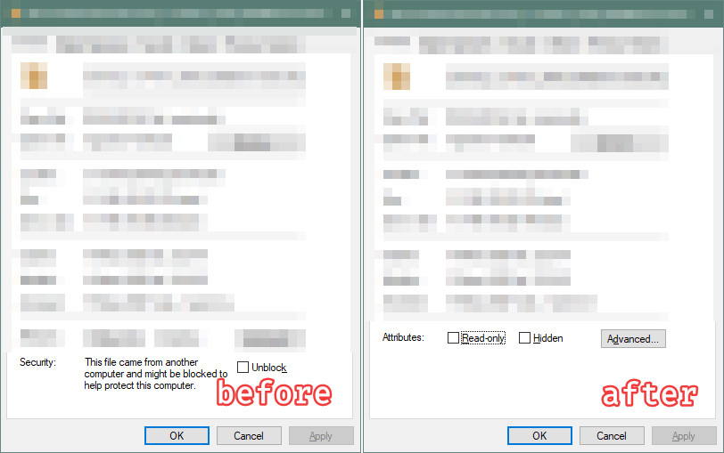
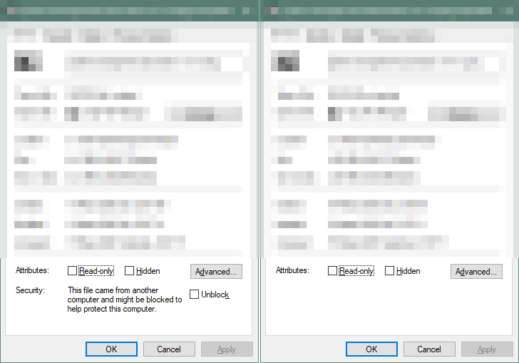

## Discovered A Powershell Function Named `Unblock-File`

It is under the `Microsoft.PowerShell.Utility` module. So we will inspect this module's source code.

```powershell
>  get-command Unblock-File                                                                                                                                                                                                                                                                                                                                                                                                                                                               CommandType     Name                                               Version    Source                                                                                                                                                         -----------     ----                                               -------    ------                                                                                                                                                         Cmdlet          Unblock-File                                       3.1.0.0    Microsoft.PowerShell.Utility
```

The module is placed under the `System32` folder at `\WindowsPowerShell\v1.0\Modules\`

`Microsoft.PowerShell.Utility.psm1` does not have a function named `Unblock-File`. It must be defined in an .NET assembly.

Lets inpsect the Powershell module definition:

```powershell
@{
GUID="1DA87E53-152B-403E-98DC-74D7B4D63D59"
Author="Microsoft Corporation"
CompanyName="Microsoft Corporation"
Copyright="© Microsoft Corporation. All rights reserved."
ModuleVersion="3.1.0.0"
PowerShellVersion = '5.1'
...
NestedModules="Microsoft.PowerShell.Commands.Utility.dll","Microsoft.PowerShell.Utility.psm1"
               ^^^^^^^^^^^^^^^^^^^^^^^^^^^^^^^^^^^^^^^^^
}
```

## Found the Module Source Code at Github

Since Powershell is an Open Source Project, we are able to inspect it's source on Github [^github]

```csharp
/// <summary>Removes the Zone.Identifier stream from a file.</summary>
[Cmdlet(VerbsSecurity.Unblock, ...)]
public sealed class UnblockFileCommand : PSCmdlet

  ...

  AlternateDataStreamUtilities.DeleteFileStream(path, "Zone.Identifier");

  ...
```

Again, `AlternateDataStreamUtilities` is defined in another assembly: `System.Management.Automation`

## Found the Module on Nuget

We found the `System.Management.Automation` assembly on Nuget [^nuget]
And downloaded it for decompiling.
Upon decompiling with ILSpy, found the `internal` method eventually.


- asdasd

{}

## Reimplementing with LinqPad

```csharp
 var path = @"C:\Users\guneysus\Downloads\PowerToysSetup-0.18.0-x64.msi";
 var streamName = "Zone.Identifier";
 string text = streamName.Trim();

 if (text.IndexOf(':') != 0)
 {
  text = ":" + text;
 }

 var fileStreamName = (path + text);

 fileStreamName.Dump();

 File.Delete(fileStreamName);
```

It worked. We implemented a feature *Unblock File* like Microsoft's Streams [^streams] tool.



## Implementing with Pure Powershell Function

Too more layer for a simple function.
> A powershell function defined in an assembly that depends a Nuget Package.

Let's try to reimplement it with pure Powershell function disregarding the reality "Powershell depends to .NET"

A simple and dirty PoC succeeded.

```powershell
> $stream = "C:\Users\guneysus\Downloads\system.management.automation.7.0.1.nupkg:Zone.Identifier"
>  rm $stream
```



## Conclusion

I do not think that Microsoft is hiding the implementation of *Unblocking Files with Removing Alternate File Streams*.
Wrapping .NET assemblies with a thin layer of Powershell scripts seems a good practise, since .NET assemblies is more reusable and testable.

And in some time, you may need a simple functionality in a limited environment.

In brief:

> Discovering and learning the under the hood" mindset is trademark of a a hacker.
> 
> 


[^nuget]: [nuget.org/packages/System.Management.Automation](https://www.nuget.org/packages/System.Management.Automation)
[^github]: [github.com/PowerShell/PowerShell/UnblockFile.cs#L130](https://github.com/PowerShell/PowerShell/blob/056b9d7/src/Microsoft.PowerShell.Commands.Utility/commands/utility/UnblockFile.cs#L130)
[^streams]: [Sysinternals Streams Tool](https://docs.microsoft.com/en-us/sysinternals/downloads/streams)
