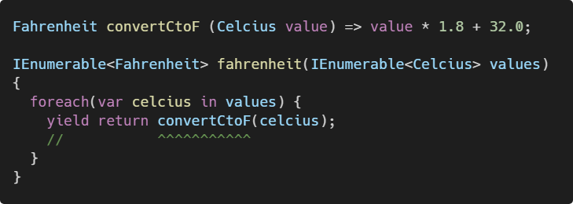

## Giriş

Önceki yazımızda fonksiyon delegelerinden bahsettik. Bu yazımızdan itibaren fonksiyonel programlama yöntemlerini C# ile uygulama yöntemlerinden bahsetmeye başlayacağız.

- Map
- Filter
- Reduce

<!-- <blockquote class="twitter-tweet"><p lang="en" dir="ltr">Map/filter/reduce in a tweet:<br><br>map([🌽, 🐮, 🐔], cook)<br>=&gt; [🍿, 🍔, 🍳]<br><br>filter([🍿, 🍔, 🍳], isVegetarian)<br>=&gt; [🍿, 🍳]<br><br>reduce([🍿, 🍳], eat)<br>=&gt; 💩</p>&mdash; Steven Luscher (@steveluscher) <a href="https://twitter.com/steveluscher/status/741089564329054208?ref_src=twsrc%5Etfw">June 10, 2016</a></blockquote> <script async src="https://platform.twitter.com/widgets.js" charset="utf-8"></script> -->

### Map

Steven alttaki tweetiyle `Map`, `Filter` ve `Reduce` yöntemlerini çok güzel şekilde ifade etmiş:



* **`Cook`** ismindeki fonksiyonumuz Girdi olarak `[🌽, 🐮, 🐔]` alıyor ve herbirini pişirerek `[🍿, 🍔, 🍳]`'e dönüştürüyor.
* **`isVegeterian`** filtresi `[🍿, 🍔, 🍳]` arasından vejeteryanler için olmayanları filtreliyor.
* **`eat`** `reduce` fonksiyonu ise `[🍿, 🍳]` alıp …

### Biraz Teori

Hafifçe teorik gidelim:

Elimizde bir `f(x)` fonksiyonu olsun.

```txt
f(x) = y
```

x, sıcaklık birimi Celcius olsun ve `f(x)` fonksiyonu, Celcius birimini
Fahrenheit birimine çeviren bir fonksiyon olduğunda `f(x)` bir `Map`  (dönüşüm)
fonksiyonu diyebiliriz.

```txt
f(°C) = °F
```

### C# `Map` Kullanımı

`Map` fonksiyonunun C# dilindeki karşılığı `IEnumerable` extension metodu olan
`Select` fonksiyonudur. Bu yazımızda `Select` fonksiyonunu kullanmayacağız,
benzerini kendimiz geliştireceğiz.

<!-- ```cs
IEnumerable<TOut> map<T, TOut>(IEnumerable<T> source, Func<T, TOut> func) {
  foreach (var element in source)
    yield return func(element);
}
``` -->


### Celcius ↔ Fahrenheit Dönüşüm Fonksiyonu

Celcius ↔ Fahrenheit dönüşüm fonksiyonundan yola çıkarak elimizdeki fonksiyonun
bir adet girdisi ve bir adet çıktısı olmalı. Alttaki gibi dönüşüm fonksiyonumuz
olduğunu farz edelim.

<!-- ```csharp
Fahrenheit convertCtoF (Celcius value) => value * 1.8 + 32.0;
``` -->


## C# Delegelerini Kullanarak Kendi `Map` Fonksiyonumuzu Yazalım

Önceki yazılarımızda  `Func<T, TResult>` delegesinden bahsetmiştik. Bu dönüşüm
fonksiyonumuzu delege ile temsil etmek istersek:

<!-- ```csharp
Func<Celcius, Fahrenheit> convertor = convertCtoF;
``` -->


Elimizdeki bir Celcius veri setini, Fahrenheit değerlerine çevirecek bir
fonksiyon yazalım ve bunu delegeleri kullanarak yapalım.

### Alternatif #1

<!-- ```csharp
Fahrenheit convertCtoF (Celcius value) => value * 1.8 + 32.0;

IEnumerable<Fahrenheit> fahrenheit(IEnumerable<Celcius> values) {
  foreach(var celcius in values) {
    yield return convertCtoF(celcius);
    //           ^^^^^^^^^^^
  }
}
``` -->



Buradaki yaklaşım fonksiyonel programlama yöntemlerine uygun olmadı:

1. **`fahrenheit`** fonksiyonu, parametreleri dışında `global` olan dış bir değişkene (`convertCtoF`) bağımlı. saf (`pure`) değil çünkü içeride kullanılan değerler parametrelerden alınmamış. Diğer ifadeyle `hardcoded` bir değer.

2. **`convert`** fonksiyonuna direkt bağımlılık mevcut. Diğer ifadeyle `tightly coupled` **`convertCtoF`** fonksiyonu buraya parametre olara geçilebilmeliydi.

> Çözüm, fonksiyonları delege olarak tanımlayarak _low-level_ `convertCtoF` fonksiyonumuzu _high level_ `fahrenheit` fonksiyonumuza parametre olarak geçmek.

### Alternatif #2

<!-- ```csharp
IEnumerable<Fahrenheit> fahrenheit(IEnumerable<Celcius> values, Func<Celcius, Fahrenheit> convertor) {
  foreach(var celcius in values)
    yield return convertor(celcius);
}
``` -->


Yeni fonksiyonumuza `Func<Celcius, Fahrenheit>` delege tipinde yeni bir parametre ekledik.Böylece bu delege tipine uyumlu herhangi bir fonksiyonu parametre olarak geçebileceğiz.

Kullanımı:

<!-- ```csharp
Func<Celcius, Fahrenheit> convertor = convertCtoF;
var fahrenheitValues = fahrenheit(celciusValues, convertor);
``` -->


### Genel amaçlı bir `map` fonksiyonu geliştirelim

Genel amaçlı bir `map` fonksiyonunu geliştirebilmek için elimizdeki `hardcoded` olan tip parametrelerini jenerik hale getirmemiz gerekli.

<!-- ```csharp
IEnumerable<TResult> map<T, TResult>(IEnumerable<T> values, Func<T, TResult> convertor) {
  foreach(var value in values)
    yield return convertor(value);
}
``` -->


Kullanımı:

<!-- ```csharp
Func<Celcius, Fahrenheit> convertor = convertCtoF;
var fahrenheitValues = map<Celcius, Fahrenheit>(celciusValues, convertor);

// Type parametreleri olmadan da çağırabiliriz.
var fahrenheitValues = map<Celcius, Fahrenheit>(celciusValues, convertor);
``` -->


Yeni `map` fonksiyonumuzla beraber sıcaklık değer listelerini, diğer birimlere
çevirecek fonksiyonları tek tek yazmak yerine `map<T, TResult>` fonksiyonunu
kullanarak türetebileceğiz.

Örnek:

<!-- ```csharp
var celciusValues = new List<Celcius>() { -40, 0, 100 };

var celciusToFahrenheitValues = map (celciusValues, convertCtoF);

var celciusToKelvinValues = map<Celcius, Kelvin> (new List<Celcius>() { -273, 0, 100 }, value => value + 273.0);

var fahrenheitToCelciusValues = map<Fahrenheit, Celcius> (celciusToFahrenheitValues, value => (value - 32) / 1.8);
``` -->


## Sonuç

Bu yazımızda fonksiyon delegelerini kullanarak genel amaçlı bir `map` implementasyonu yazmaya çalıştık.
Siz de bir `code kata` [^code-kata] uygulaması olarak ÖTV ve KDV hesaplayan fonksiyonlar yazabilir, bu fonksiyonları delege yardımıyla  `map` fonksiyonu aracılığıyla kullanabilirsiniz. 

Örnek bir uygulama içeren LINQPad dosyasını ekte bulabilirsiniz.


## Edit

- _2020/12/20_ - İş arkadaşım Zişan, LINQ Pad dosyası örneği yerine dotnet fiddle önerdi. Linki aşağıya bırakıyorum, kaydırarak açabilirsiniz.

## Bağlantılar

1. <https://docs.microsoft.com/en-us/dotnet/csharp/language-reference/keywords/select-clause>
2. <https://docs.microsoft.com/en-us/dotnet/api/system.linq.enumerable.select?view=netcore-3.1>
3. [MAP - dotnet fiddle](https://dotnetfiddle.net/wJqnxs)

[^code-kata]: https://en.wikipedia.org/wiki/Kata_(programming)
