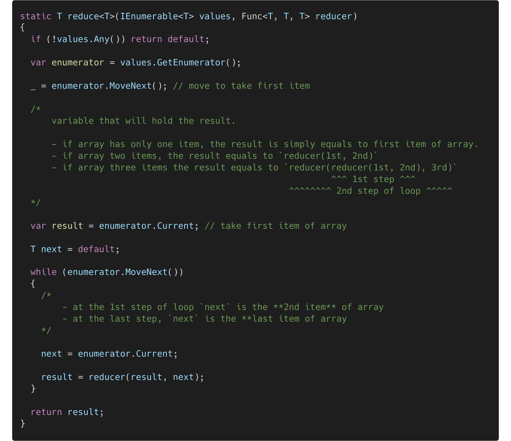

## Giriş

Bu yazımız görsel ağırlıklı olacak.

`Reduce`, boyutu küçültme anlamına gelir. Bir array üzerinde işlem yapıp, daha küçük boyutlu (genellikle tek elemanlı) bir dizi elde etme işlemi `Reduce`, SQL ifadesiyle bir `Aggregate` işlemidir.

Aslında `Filter` işlemi de `Reduce` ile tanımlanabilse de genellikle `Reduce` işlemi sonucunda tek elemanlı bir sonuç çıkması gerektiği farzedilir.

1 ile 6 arasındaki sayılar bir array, bu sayıların toplamı veya faktöryeli ise bir `Reduce` işlemidir.


### Reduce Uygulaması

`Reduce` algoritmasını uygulayabilmek için:

1. İlk adımda array'in ilk iki elemanı alınır ve `Reducer` fonksiyonu ile ilk değer hesaplanır
2. Diğer adımlarda `Reducer` fonksiyonun ilk parametresi geçmişten gelen sonuç, diğer parametre ise array'in bir sonraki elemanı olur.
3. Son elemana gelindiğinde `Reducer` fonksiyonundan çıkan değer sonuç olur.
4. Bazı durumlarda `Reducer` fonksiyonu için başlangıç değeri (`seed`) verilir böylece ilk adımda array'in ilk elemanı ile bu değer `reducer` fonksiyonuna girer.


#### Örnek:

1'den 6'ya kadar olan sayıları toplamak için Pseudo kodu yazıp ve fonksiyon akışını modelleyelim.

```
[1,2,3,4,5,6]

reducer(a,b) -> return a + b;

1. reducer(1,2) => 3
2. reducer(3,3) => 6
3. reducer(6,4) => 10
4. reducer(10,5) => 15
5. reducer(15, 6) => 21
                     ^^
```

Burada `1,3,6,10, 15` değerlerinin **ara sonuçlar** olduğuna dikkat edin. Her bir ara sonuç, dizinin bir sonraki elemanıyla `reducer` fonksiyonuna giriyor ve bir sonraki sonucu hesaplıyor.


<figure class="video_container">
  <video allowfullscreen="false" poster="img/reduce-illustration-1.jpg" width="400px" loop autoplay preload controls>
    <source src="img/reduce-illustration.mp4" type="video/mp4">
    <source src="img/reduce-illustration.mkv" type="video/mkv">
    <source src="img/reduce-illustration.webm" type="video/webm">
  </video>
  <figcaption>Reduce</figcaption> 
  <!-- TODO HUGO Strips figcaption !? -->
</figure>


## C# ile Reduce




## Bağlantılar

1. <https://docs.microsoft.com/en-us/dotnet/api/system.linq.enumerable.aggregate?view=net-5.0>
3. [REDUCE - dotnet fiddle](https://dotnetfiddle.net/KREkPx)